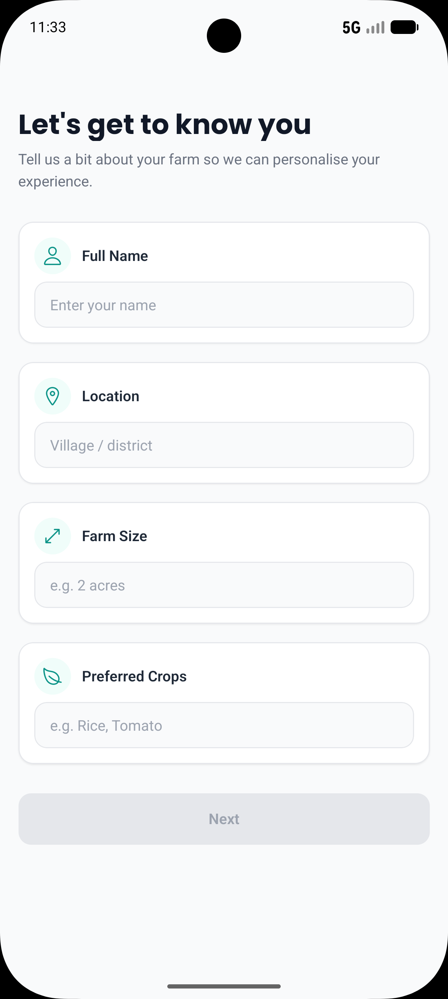
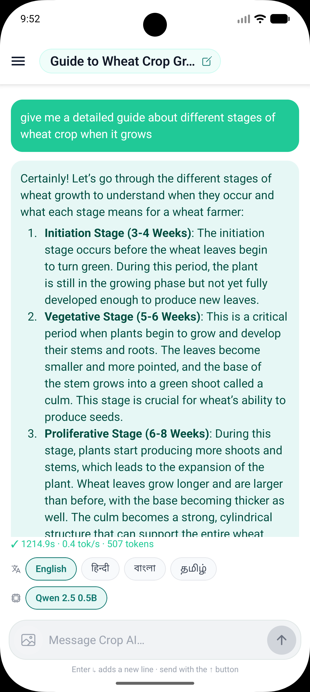
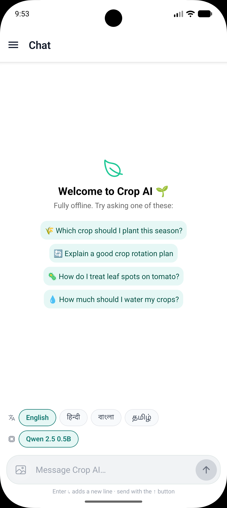
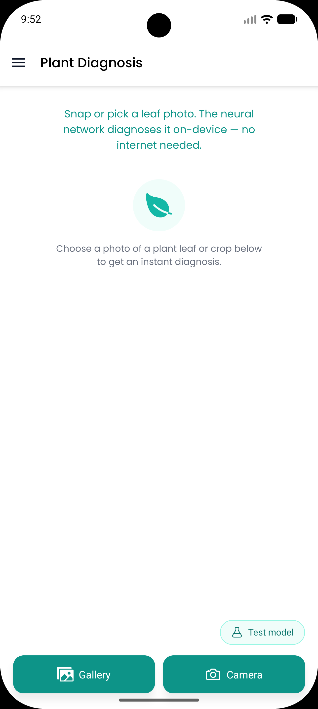
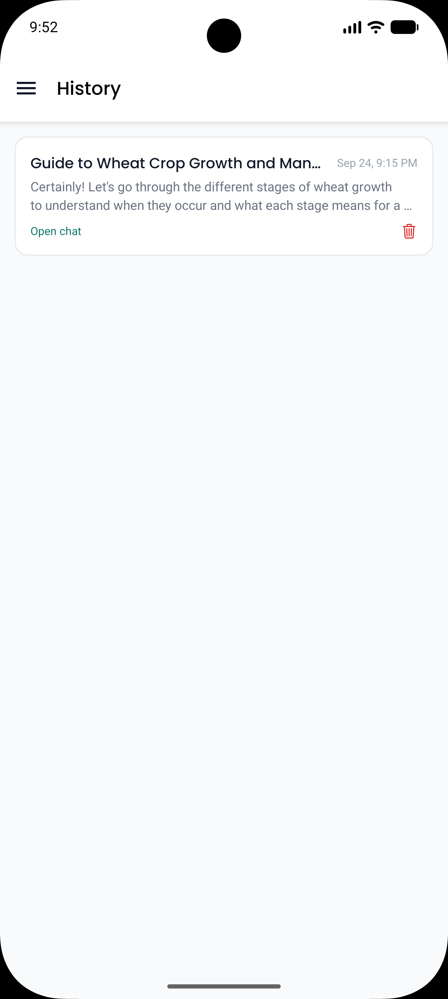
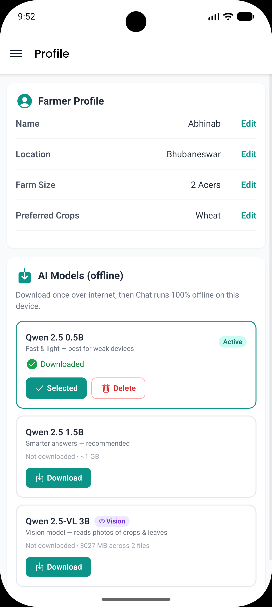
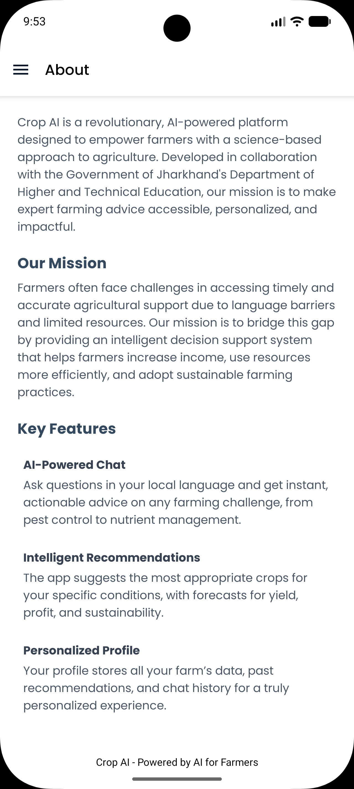

<div align="center">
  
  <h2>AI-Powered Crop Diagnosis, Advisory & Multilingual Assistance</h2>
  <p>
    An end-to-end, mobile-first platform that helps farmers diagnose crop diseases,
    get intelligent recommendations.
  </p>
</div>

<p align="center">
  <a href="https://deepwiki.com/abhinab-choudhury/Crop-AI">
    
  </a>
  <a href="https://github.com/abhinab-choudhury/Crop-AI/releases">
    
  </a>
</p>

## ⬇️ Download the Android App

The Android version of **Crop AI** is available for download from the GitHub Releases page.

👉 **[Download the latest Android APK](https://github.com/abhinab-choudhury/Crop-AI/releases)**

> Download the latest `.apk` file from the **Releases** section and install it on your Android device.

# 🚀 Overview

Crop AI is a full-stack, AI-driven agriculture platform that helps farmers with:

- 🌱 **Plant disease detection** — from a photo of a leaf
- 💬 **Conversational AI chat** — including fully **offline / on-device** after a one-time download
- 🌾 **Crop recommendation & yield prediction**
- 🌍 **Region-aware agricultural guidance**
- 🗣 **Multilingual assistant** — reply language selector: **English** (default), **हिन्दी (Hindi)**, **বাংলা (Bengali)**, and **தமிழ் (Tamil)**

The project is built as a **TurboRepo monorepo** (pnpm workspaces) combining an Expo/React Native
mobile app, a React + Vite web landing page, an Express backend, and a FastAPI ML server into a
single, scalable codebase.

---

## 🧠 System Architecture

```
            ┌──────────────┐
            │  Mobile App  │  (React Native + Expo)
            └──────┬───────┘
                   │
        ┌──────────▼─────────┐
        │   Backend Server   │  (Node.js + Express)
        │  Auth • Chat • API │
        └──────┬──────┬──────┘
               │      │
     ┌─────────▼──┐   ▼
     │  ML Server │  MongoDB
     │  (FastAPI) │  (Mongoose)
     └────────────┘
```

> **New in the mobile app:** the big AI models run **on the device itself**
> (`llama.rn` for the Qwen LLM + ONNX Runtime for disease detection), so chat,
> vision, and disease diagnosis keep working **fully offline** after a one-time
> model download. See [docs/ON-DEVICE-MODELS.md](docs/ON-DEVICE-MODELS.md).

---

## ✨ Features Status

### 🤖 AI Chat

- [x] Conversational assistant
- [x] **Fully offline on-device LLM** (Qwen 2.5 0.5B/1.5B) via `llama.rn`
- [x] **Multilingual replies** — English (default), Hindi, Bengali, and Tamil via an in-chat language selector
- [x] **Vision model** (Qwen 2.5-VL 3B) — send photos and the AI understands them on-device
- [x] Streaming replies with a typing / thinking indicator
- [x] Markdown-formatted replies (bold, lists, code, tables)
- [x] Attach **plant photos** directly in chat
- [x] On-device **chat title suggestions**
- [ ] Custom **tool calling system** on the server (not LangChain-based)

### 🌿 Plant Disease Detection

- [x] **On-device disease detection** using ONNX (ResNet9, 38 classes)
- [x] Resumable, cancellable model download with progress + speed + ETA
- [x] Detection works **offline** after the model is downloaded
- [x] Cloud fallback via the FastAPI ML server (ResNet49 → ResNet18 → ResNet50 evolution)

### 🌾 Crop Recommendation & Prediction

- [x] Multiple classical ML models trained and evaluated (XGBoost)

### 📱 Mobile Experience

- [x] Chat history + thread rename with AI-suggested titles
- [x] Email OTP login (JWT, no password)
- [x] Android APK builds via GitHub Actions

---

## 🛠 Tech Stack

### Frontend

- React Native + Expo (mobile)
- React + Vite (web landing page)
- llama.rn, ONNX Runtime (on-device inference)
- Email OTP Authentication (JWT)

### Backend

- Node.js + Express
- MongoDB + Mongoose
- Ollama (LLM runtime)

### Machine Learning

- FastAPI
- PyTorch
- Scikit-learn
- XGBoost

### DevOps

- TurboRepo
- Docker & Docker Compose
- pnpm

---

## 📁 Project Structure

```
Crop-AI/
├── apps/
│   ├── native/       # Mobile app (React Native + Expo) — chat, vision, disease detection
│   ├── ml-model/     # ML training scripts + model artifacts (convert.py, ONNX exports)
│   ├── ml-server/    # ML server (FastAPI — disease detection, crop/yield prediction)
│   ├── server/       # Backend API (Express + MongoDB + Ollama)
│   └── web/          # Web landing page (React + Vite)
├── docs/             # Architecture + on-device model guides
├── .github/
│   └── workflows/    # Android APK build workflow
└── package.json      # TurboRepo root
```

---

## 📸 Screenshots

<p align="center">
  
  
</p>
<p align="center">
  
  
  
</p>
<p align="center">
  
  
</p>

---

## 🚀 Getting Started

### 1. Install Dependencies

```bash
pnpm install
```

Set up the ML server (Python with [`uv`](https://astral.sh/blog/uv/)):

```bash
cd apps/ml-server
uv venv
uv sync
```

Optional app setups:

```bash
cd apps/native && pnpm install   # mobile
cd apps/server && pnpm install   # backend
cd apps/web    && pnpm install   # web landing page
```

### 2. Database Setup

This project uses **MongoDB** with **Mongoose**.

1. Ensure MongoDB is installed and running.
2. Update `apps/server/.env` with your MongoDB connection URI.

Get API Keys from

- [WEATHER API](https://www.weatherapi.com/)
- [TAVILY](https://app.tavily.com/)

### 3. Running the Project

```bash
pnpm dev
```

Specific apps:

| Command              | Description                                |
| -------------------- | ------------------------------------------ |
| `pnpm dev`           | Start all applications in development mode |
| `pnpm dev:native`    | Start the React Native / Expo app          |
| `pnpm dev:web`       | Start the web landing page (Vite)          |
| `pnpm dev:server`    | Start the Express backend                  |
| `pnpm dev:ml-server` | Start the FastAPI ML server                |
| `pnpm check-types`   | Type-check all packages                    |

> **About Expo Go:** the disease-detection and on-device LLM features use custom native
> modules (`llama.rn`, ONNX Runtime), so they need a **development build**, not Expo Go:

```bash
cd apps/native
npx expo run:android   # or: npx expo run:ios
```

---

## 📦 Build an Android APK (test on your phone)

The **native app** builds into an installable `.apk` with the provided **GitHub Actions**
workflow — no local Android toolchain needed:

```bash
git push origin main        # pushes once → runs the CI workflow once
```

Then on GitHub: **Actions → Build Android APK → Run workflow**, and download the
`crop-ai-apk` artifact from the completed run. It's signed for direct install on any
device; first run downloads the on-device LLM + ONNX disease model (resumable, cancellable).

For a local build (JDK 17 + Android SDK / NDK), see [apps/native/README.md](apps/native/README.md#building-the-android-apk).

